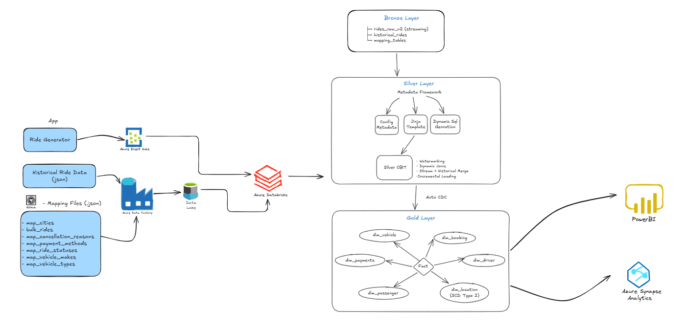
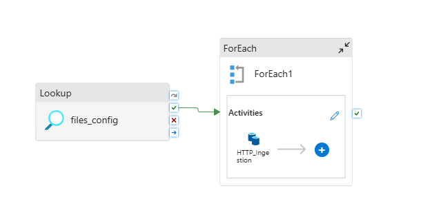
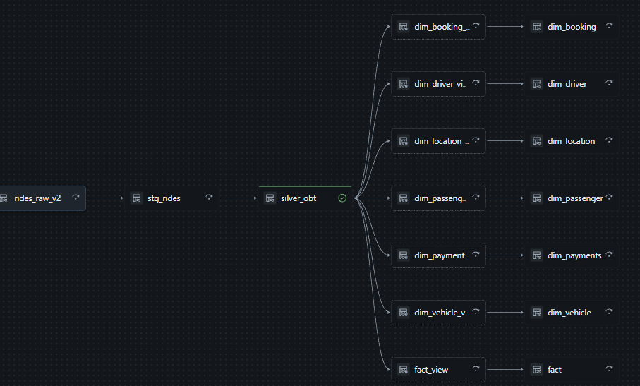

# 🚖 Real-Time Ride Analytics Platform using Azure & Databricks

## 📖 Project Overview

This project demonstrates a metadata-driven real-time analytics platform built using Azure Event Hub, Azure Data Factory, Azure Data Lake Storage Gen2, and Databricks.

The solution processes real-time ride events, combines them with historical ride data and reference mapping datasets, and creates a dimensional model for analytics using CDC and SCD Type 2 techniques.

A metadata-driven framework using configuration tables and Jinja templates enables dynamic SQL generation, allowing new mapping datasets to be onboarded without code changes.

---

## 🏗️ Architecture



---

## 🎯 Business Problem

Ride-sharing platforms generate both historical and real-time ride events.

The challenge is to:

- Process real-time ride events continuously
- Combine streaming and historical data
- Enrich rides using multiple reference datasets
- Support incremental processing
- Handle late-arriving data
- Maintain historical dimension changes
- Provide analytics-ready fact and dimension tables

---

## ⚙️ Technology Stack

### Azure

- Azure Event Hub
- Azure Data Factory (ADF)
- Azure Data Lake Storage Gen2

### Databricks

- Structured Streaming
- Delta Lake
- Auto CDC
- Lakehouse Architecture

### Development

- Python
- PySpark
- SQL
- Jinja2
- JSON Metadata


---

# 🔄 End-to-End Data Flow

## Step 1: Ride Event Generation

A custom Python-based ride generator simulates real-time ride booking events.

```text
Ride Generator
      ↓
Azure Event Hub
```

---

## Step 2: Historical Data Ingestion



Historical ride datasets are loaded through Azure Data Factory into Azure Data Lake Storage.

```text
Historical Ride Data
      ↓
ADF
      ↓
ADLS
```

---

## Step 3: Metadata Ingestion

Mapping datasets stored in GitHub are ingested dynamically using Azure Data Factory.

Examples:

- map_cities
- map_payment_methods
- map_vehicle_types
- map_ride_statuses
- map_vehicle_makes
- map_cancellation_reasons

```text
GitHub
      ↓
ADF
      ↓
ADLS
```

---

## Step 4: Bronze Layer

Raw data is loaded into Databricks Bronze Layer.

Tables:

- rides_raw_v2 (Streaming)
- historical_rides
- mapping_tables

---

## Step 5: Metadata-Driven Framework

The framework dynamically generates SQL transformations using metadata.

### Components

- Configuration Metadata
- Jinja Templates
- Dynamic SQL Generation

### Benefits

- New mapping files can be onboarded through metadata
- No code changes required
- Reduced maintenance effort
- Reusable transformation framework

---

## Example Metadata Configuration

```json
{
  "target_table": "silver_obt",
  "base_table": "rides_raw_v2",
  "joins": [
    {
      "table": "map_cities",
      "type": "left",
      "on": "city_id"
    }
  ]
}
```

---

## Example Jinja Template

```sql
SELECT
    {{ select_columns }}
FROM {{ base_table }}


LEFT JOIN {{ join.table }}
ON {{ join.on }}

```

---

## 🥈 Silver Layer

The Silver Layer creates an enriched One Big Table (OBT).

Features implemented:

- Dynamic SQL Generation
- Incremental Processing
- Watermarking
- Stream + Historical Data Merge
- Reference Data Enrichment

Output:

```text
silver_obt
```

---

## ⏱️ Watermarking

Watermarking is implemented to handle late-arriving ride events.

Benefits:

- Controls state growth
- Supports streaming joins
- Prevents duplicate processing
- Improves stream reliability

---

## 🔁 Change Data Capture (CDC)

Auto CDC is implemented to process incremental changes from the Silver OBT.

Benefits:

- Processes only changed records
- Improves performance
- Supports historical tracking

---

## Slowly Changing Dimensions (SCD Type 2)

Implemented for:

```text
dim_location
```

Features:

- Historical version tracking
- Effective date management
- Current record identification

---

## 🥇 Gold Layer

Star Schema implementation.

### Fact Table

```text
fact_rides
```

### Dimension Tables

```text
dim_driver
dim_passenger
dim_vehicle
dim_location
dim_booking
dim_payments
```

---

## 📊 Databricks Pipeline DAG



The DAG demonstrates:

- Bronze → Silver → Gold flow
- Dependency management
- CDC processing
- Dimension and Fact table creation

---


## 🚀 Key Engineering Concepts Demonstrated

- Real-Time Data Processing
- Structured Streaming
- Watermarking
- Delta Lake
- CDC
- SCD Type 2
- Data Modeling
- Metadata-Driven ETL
- Dynamic SQL Generation
- Azure Event Hub Integration
- Azure Data Factory Orchestration
- Bronze-Silver-Gold Architecture

---

## 📂 Repository Structure

```text
project-root/
│
├── Images
│   └── architecture.png
|   └── pipleline_day.png
│
├── data/
│   ├── config.json
│   └── mapping_files
│
├── templates/
│   └── silver_obt.sql.j2
│
├── notebooks/
│   ├── bronze_adls
│   ├── silver.py
│   ├── silver_obt.sql
│   └── ingest.py
|   └── Silver_obt.py
|   └── Model.py
│
└── README.md
```

---

## 🔮 Future Enhancements

- Unity Catalog Integration
- CI/CD using GitHub Actions
- Databricks Asset Bundles
- Data Quality Framework
- Automated Testing
- Multi-source Streaming Ingestion
- AWS Deployment Version

---

## 👨‍💻 Author

Data Engineering Project demonstrating:

- Azure Data Engineering
- Databricks Lakehouse
- Real-Time Streaming
- Metadata-Driven Processing
- Dimensional Modeling
